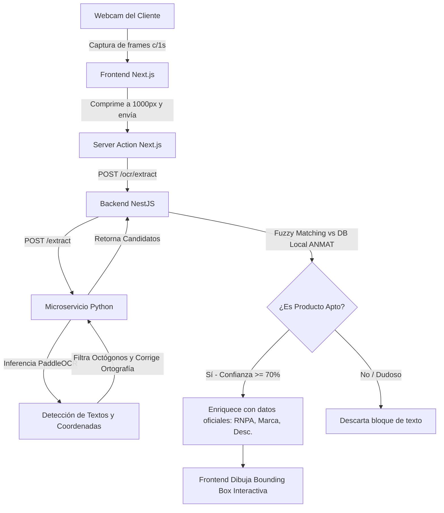

# 🌿 CeliApp

App móvil y web para la comunidad celíaca argentina. Permite escanear productos, encontrar comercios con opciones sin TACC y colaborar con otros usuarios para construir un mapa de lugares aptos.

---

## ¿Qué hace la app?

- **Escáner de productos** — apuntás la cámara a un producto y la app te dice si es apto para celíacos según la base oficial de ANMAT. También podés hacer un paneo por la góndola del supermercado y detectar productos en tiempo real mediante código de barras.
- **Mapa colaborativo** — mapa con comercios, restaurantes y locales que tienen sección o menú sin TACC. Cualquier usuario puede agregar un lugar nuevo.
- **Sistema de puntos y ranking** — cada vez que agregás un comercio ganás puntos.

---

## 🚀 Cómo Correr el Proyecto

El proyecto está completamente dockerizado y estructurado en tres servicios principales:

1. **Frontend**: Next.js (App Router con Turbopack) corriendo en el puerto `3000`.
2. **Backend**: NestJS (API REST y validación) corriendo en el puerto `3001`.
3. **OCR Service**: Microservicio en Python (FastAPI + PaddleOCR) corriendo en el puerto `6060`.

### Requisitos Previos

- Tener instalado **Docker** y **Docker Compose**.
- Archivo `.env` en la raíz del proyecto configurado.

### Instalar y Iniciar

Para levantar todo el entorno de desarrollo de forma local y limpia, ejecuta:

```bash
# Levantar los contenedores en segundo plano (build inicial automático)
docker compose up -d

# Ver los logs en tiempo real para verificar el estado de compilación
docker compose logs -f
```

Una vez levantado:

- **Frontend**: Accedé a `http://localhost:3000`
- **Backend API**: Accedé a `http://localhost:3001/api` (Swagger disponible)
- **OCR Microservice**: Disponible internamente en el puerto `6060`

### Comandos de Utilidad

```bash
# Apagar contenedores y borrar volúmenes de caché (limpieza completa)
docker compose down -v

# Reiniciar un servicio específico (ej: frontend)
docker compose restart frontend
```

### 📥 Actualización de la Base de Datos de ANMAT (Scraping/Crawling)

La aplicación valida los productos contra un catálogo local pre-normalizado en `server/data/anmat_celiac_catalog.json` (que incluye más de 26,000 productos registrados). Para actualizar este catálogo raspando la web oficial de ANMAT en tiempo real, podés ejecutar:

```bash
# Navegar al directorio del backend
cd server

# Instalar dependencias locales si no las tenés
npm install

# Correr el script de crawling
npm run crawl
```

*Nota: El crawler realiza la consulta de manera secuencial e incluye una pausa de 500ms entre solicitudes para no sobrecargar el servidor oficial de la ANMAT.*

---

## 🛠️ ¿Cómo Funciona la App?

### 1. Escáner de Góndola en Tiempo Real (OCR + ANMAT)

El núcleo tecnológico es un flujo de detección y validación asíncrono y en tiempo real:



#### Flujo Detallado:

1. **Captura y Optimización:** El frontend captura fotogramas de la webcam cada 1 segundo. Para optimizar el ancho de banda y la velocidad de red, la imagen se redimensiona en el cliente a un máximo de `1000px` de ancho antes de ser enviada.
2. **Inferencia OCR (Python + PaddleOCR):** El microservicio de Python procesa la imagen para detectar bloques de texto y sus coordenadas espaciales.
   - **Filtro de Octógonos:** Remueve automáticamente palabras basura provenientes de sellos negros de advertencia (como _"EXCESO EN", "SODIO", "AZUCARES", "GRASAS"_).
   - **Corrector Ortográfico (Vocabulario ANMAT):** Utiliza un corrector ortográfico entrenado localmente con las palabras clave del catálogo ANMAT para corregir letras mal leídas por el OCR.
3. **Validación Fuzzy Local (NestJS + Fuzzball):** El backend compara los textos detectados contra una base de datos local pre-normalizada de **más de 26,000 productos aptos de la ANMAT**.
   - Para ser ultra rápido, primero aplica un filtro de vocabulario tipo índice invertido.
   - Luego, calcula la similitud semántica con algoritmos de distancia de strings (_Token Sort_ y _Token Set Ratio_).
   - Si la coincidencia supera el 70%, el producto se aprueba y se asocia a su registro oficial.
4. **Visualización y Clicks en Pantalla:** El frontend proyecta los recuadros verdes (Apto) o rojos encima de la cámara web. Al tocar un recuadro o tarjeta, se despliega un panel flotante de detalles (Drawer) mostrando el **RNPA**, la **Denominación oficial de ANMAT** y el **Porcentaje de coincidencia**.

### 2. Otras Características

- **Mapa Colaborativo:** Permite visualizar y registrar comercios aptos para celíacos.
- **Accesibilidad Avanzada:** Preparado con temas de alto contraste, compatibilidad con lectores de pantalla y tipografía adaptativa para dislexia.
